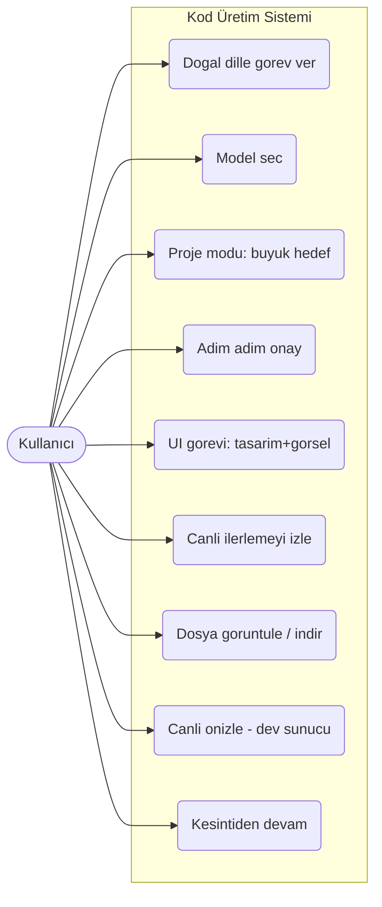
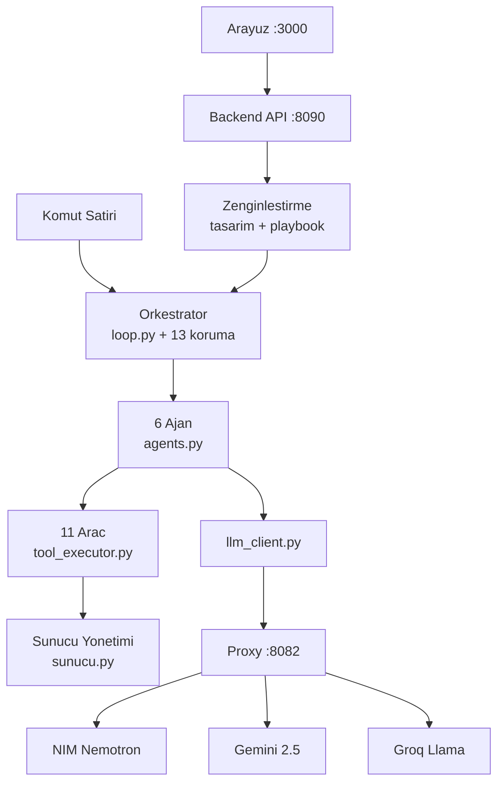
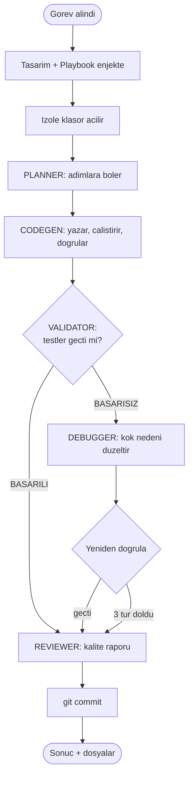
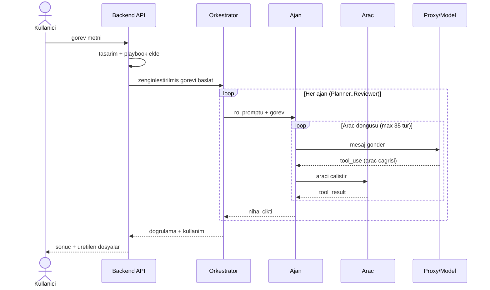
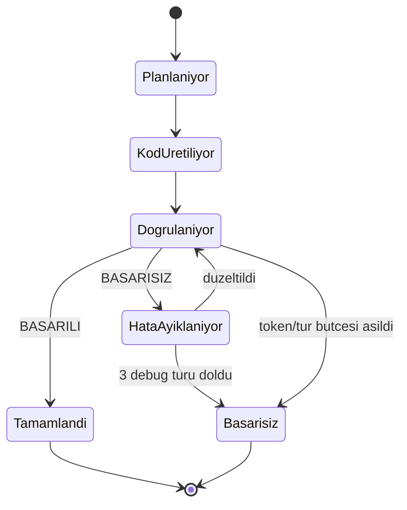

# Agentic Kod Üretim Sistemi — Proje Raporu

> Faz 9 (Doğal Dil Katmanı) · 16.07.2026 · 171 test geçiyor · 6 ajan · 11 araç · 13 koruma
> Görsel/interaktif sürüm: bu rapor Artifact olarak da yayınlandı (mermaid diyagramları render'lı).
> Güncel fotoğraf: [DURUM.md](DURUM.md) · Faz geçmişi: [task_plan.md](task_plan.md)

---

## 1. Ne yapar, neden özel?

Sıradan bir sohbet botuna "kod yaz" dediğinizde size **metin** verir — dosyaya yapıştırmak,
çalıştırmak, çıkan hatayı geri bildirmek size kalır. O döngüde orkestratör, çalıştırıcı ve
doğrulayıcı *sizsiniz*. Bu sistemde döngünün tamamı makinededir: dosya gerçekten yazılır,
test gerçekten koşulur, sayfa gerçekten tarayıcıda açılıp *görülür*, hata gerçekten yakalanıp
düzeltilir.

> **Merkezdeki tek ilke:** "Kod, üretildiği için değil, çalıştığı kanıtlandığı için doğrudur."
> Bir dil modeli kendinden emin biçimde bozuk kod üretebilir — bu yüzden her çıktı gerçekten
> çalıştırılıp kanıtla onaylanır.

Bu, Claude Code, Cursor ve Devin'in ait olduğu kategoridir: **agentic (ajans temelli) kod
üretimi.** Farkımız, bunu ücretsiz/açık LLM altyapısı üzerine, kendi orkestratörümüz ve
güvenlik katmanlarımızla sıfırdan inşa etmiş olmamızdır.

---

## 2. Kullanıcı ne yapabilir? (Use Case)

Kullanıcı yalnızca *ne* istediğini söyler; teknik detayları (portlar, araç akışı, doğrulama
adımları) sistem kendi ekler.

---

## 3. Sistem mimarisi

Altı katman üst üste oturur; her katman yalnızca altındakiyle konuşur.

**Proxy'nin değeri:** Kodumuz tek bir API biçimine (Anthropic Messages) göre yazıldı; hangi
modelin cevap vereceği proxy'nin arkasında bir ayrıntıdır. Yeni sağlayıcı eklersek
orkestratörde tek satır değişmez — yalnızca istekteki model adı değişir.

---

## 4. Modüller

Sistem `orchestrator/` altında görev bazlı bölünmüş modüllerden oluşur; her biri tek bir
sorumluluğa sahiptir.

| Modül | Sorumluluk |
|---|---|
| `loop.py` | **Orkestratör (çekirdek).** Ajan döngüsü, aşama sırası, debugger↔validator döngüsü, 13 korumanın tamamı. |
| `agents.py` | 6 ajanın tanımı: sistem promptu, izinli araçlar, model seçimi. |
| `tool_executor.py` | 11 aracın gerçeklemesi; dosya/kabuk/tarayıcı/sunucu. Path güvenliği. |
| `llm_client.py` | Proxy'ye istek; 429/5xx'te yeniden deneme; token sayacı. |
| `proje.py` | Proje modu: büyük hedefi böler, zincir koşar, entegrasyon doğrular. |
| `sunucu.py` | Arka plan süreç yönetimi; IPv4+IPv6 port, süreç ağacı öldürme, sızıntı önleme. |
| `gorsel.py` | Ekran görüntüsünü Gemini'yle analiz (karma model). |
| `playbook.py` | Görev tipini tanıyıp teknik tarifi göreve enjekte eder (doğal dil katmanı). |
| `tasarim.py` | ui-ux-pro-max tasarım sistemini göreve ekler. |
| `indeks.py` | Repo araması: TF-IDF / Gemini embedding. |
| `git_deposu.py` | Görev klasöründe otomatik commit (kendi reposu). |
| `calisma_alani.py` | Görev başına izole klasör + pytest izolasyon sigortası. |
| `state.py` | Oturum/proje durumu (kesintiden `--devam`). |
| `api.py` | FastAPI: görev/durum/onay, dosya, önizleme uçları. |

---

## 5. Ajanlar ve görevleri

Sistemin kalbi altı uzman ajandır. Hiçbiri ayrı yazılım değil — hepsi **aynı dil modeline
verilmiş farklı rol talimatlarıdır.**

| Ajan | Görevi |
|---|---|
| **Planner** | Görevi numaralı, dosya bazlı adımlara böler. Kod yazmaz. |
| **Codegen** | Dosyaları yazar, edit_file ile düzeltir, çalıştırıp doğrular. İşin yükü. |
| **Validator** | Testleri koşar, "geçti/kaldı" der. Mevcut dosyayı değiştiremez. |
| **Debugger** | Başarısızlıkta hatayı yeniden üretip kök nedeni düzeltir (en çok 3 tur). |
| **Reviewer** | Çalışan koda kıdemli gözle kalite raporu yazar. Dosya değiştirmez. |
| **Decomposer** | Büyük hedefi 2–8 alt göreve böler (proje modu). |

### Ajan döngüsü

### Katmanlar arası konuşma (Sıra Diyagramı)

### Görev yaşam döngüsü (Durum Diyagramı)

---

## 6. Araçlar — ajanların elleri ve gözleri

11 araç; hepsi çalışma alanına **hapsedilmiştir** (workspace dışına yazamaz/okuyamaz).
Araç hataları çökme değil, modele geri beslenen açıklamalı mesaj olarak döner.

| Araç | İşlev |
|---|---|
| list_files / search_files | Dosyaları listeler; içeriğe göre en ilgili dosyayı skorlar. |
| read_file / write_file | Okur; yazar (her yazmada diff). |
| edit_file | Tüm dosyayı değil, "eski→yeni" parçasını değiştirir. Büyük dosyalarda hayati. |
| run_shell | Kabuk komutu çalıştırır. Arka plan başlatıcılarını reddeder. |
| check_page | Sayfayı tarayıcıda açar: konsol hataları, screenshot, Gemini görsel analizi. Canlı URL de. |
| start_server / stop_server / server_log | Bitmeyen sunucuları (uvicorn, npm run dev) yönetir. Full-stack'in temeli. |

---

## 7. Modeller ve LLM altyapısı

| Model | Rol | Not |
|---|---|---|
| **NVIDIA NIM — Nemotron-3-Super-120B** | Birincil (ajanlar) | 120B (MoE, ~12B aktif). Tool-use 10/10. Geniş kota. |
| **Gemini 2.5 Flash** | Görsel analiz + yedek | Doğrudan REST. Görüntü anlar. |
| **Groq Llama-3.3-70B** | Yedek | Hızlı; 100k token/gün kotası dar. |

**Seçim disiplini:** Yeni model asla körlemesine kullanılmaz — önce 10 tekrarlı tutarlılık
testinden (araç şemasına 10/10 uyum) geçer. **Routing** üç kademeli: `FCC_MODEL_<AJAN>` >
`FCC_MODEL` > proxy varsayılanı. **Karma model:** Nemotron görüntü anlamadığından yalnızca
görsel analiz Gemini'ye gider; ajanlar NIM'de kalır (kota dostu).

---

## 8. Öz-sertleşme — 13 mekanik koruma

Sistemin en özgün yanı: **her koruma gerçek bir kazadan doğdu.** Model bir hata yaptığında,
onu promptla değil kod düzeyinde engelledik — zayıf modeller prompt kurallarını sıkça deler.

1. İzole görev klasörleri · 2. Kanıt şartı (araçsız karar yok) · 3. Tekrar kilidi
4. Debelenme detektörü · 5. Validator yazma kısıtı · 6. Şema uyarısı
7. Sunucu sızıntı önleme · 8. Tur sınırı + netleştirme · 9. Git kendi-repo
10. Vite file:// reddi · 11. Arka plan başlatıcı reddi · 12. Örnekli hata · 13. pytest izolasyonu

---

## 9. Kanıtlanmış yetenekler

| Yetenek | Kanıt |
|---|---|
| CLI + pytest | fibonacci, şifre üreteci — 0 debug turlu ✅ |
| Proje modu | not defteri: 4/4 alt görev + 17 test ✅ |
| Frontend | sayaç, fiyat, portfolyo — görsel doğrulamalı ✅ |
| Çok dosyalı site | HTML+CSS+JS ayrı, canlı önizlemede çalıştı ✅ |
| Vite/React | npm install + dev sunucu + canlı check_page ✅ |
| Backend (ajanlar) | FastAPI + pytest + uvicorn + curl, kalıcı state ✅ |
| Full-stack (ajanlar) | iki katman bağlı; frontend backend'den okudu — screenshot ✅ |
| Doğal dil katmanı | 2 satırlık istekten teknik tarifi sistem üretti ✅ |

---

## 10. Sınırlar ve mevcut sorun

Mekanizma ve bilgi katmanı **olgun.** Kalan temel darboğaz altyapı değil, kullanılan dil
modelinin **istikrarı ve muhakemesidir.**

- **İstikrar:** Aynı görev bir koşuda geçiyor, diğerinde savruluyor.
- **Test kalitesi:** Model bazen izole olmayan test yazıyor (state sızması).
- **Hata muhakemesi:** İlk pürüzde kök nedeni okumak yerine halüsinasyona düşebiliyor.
- **Büyük hedef:** e-ticaret ölçeği model+kota nedeniyle henüz denenmedi.

### Son full-stack koşusunun forensiği

Görev düştü: Validator 35 turda bitiremedi, **619.000 token.** Codegen backend+frontend+testi
*doğru* yazdı (playbook işe yaradı). Ama bir test başarısız oldu (`{"value": 6} == {"value": 5}`)
ve model çöktü. Üç katman:

1. **Ürün kodu:** Testler izole değil; global sayaç sızdı, 5 yerine 6.
2. **Model tavanı:** Nemotron başarısızlığı düzeltmek yerine, kurulu olmayan bir "docker"
   sorunu icat edip halüsinasyonla debeledi.
3. **Sistem açığı:** Debelenme detektörü "çöp dosya yaz→koş→yaz" döngüsünü yakalamadı
   (write_file sayacı sıfırlıyor). Ve token bütçesi yok.

---

## 11. Yol haritası

| Adım | Kapsam |
|---|---|
| **A · Güvenlik ağı** (kotasız, önce) | Ajan başına token bütçesi + güçlü debelenme detektörü. Her modeli korur — "bir daha 619k yakılmaz" garantisi. |
| **B · Güçlü kod modeli** (kota, sonra) | Codegen+Debugger'ı NIM Qwen-Coder'a al (tutarlılık testi). İstikrar + test kalitesi; A'nın yerini tutmaz. |
| **Faz 6 · API bağlama** (planlı) | Sır yönetimi (.env), bağımlılık politikası, Docker'da seçmeli ağ. |
| **Faz 9 · Analist ajanı** (2. dalga) | Belirsiz isteklerde kullanıcıya soru soran, isteği spesifikasyona çeviren üst katman. |

**Neden bu sıra:** Önce hasarı *tavanla* (A — kesin, kotasız, model-bağımsız), sonra hatanın
*olasılığını düşür* (B — güçlü model). Güvenlik ağı her modelin altında durur.
