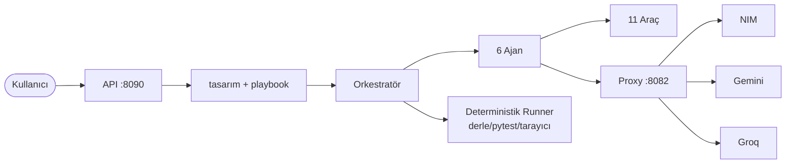

# Ana Sayfa

Teknik Dokümantasyon

# Agentic Kod Üretim Sistemi

Doğal dille verilen bir görevi alıp kodu **kendi yazan, test eden, hatasını düzelten ve çalıştırıp doğrulayan** çok-ajanlı bir yapay zekâ üretim hattı. Sohbet botu kod _metni_ verir; bu sistem çalışan, doğrulanmış bir iş _teslim eder_.

  <b>Faz 10</b> · Deterministik Doğrulama
  <b>238</b> test geçiyor
  <b>6</b> ajan
  <b>11</b> araç
  <b>20+</b> koruma

## Nereden başlamalı?

-   :material-file-document-outline: __Proje Raporu__

    ---

    Mimari, dosya yapısı, ajanlar, araçlar, modeller, korumalar ve 5 diyagram. Sistemi uçtan uca anlatan asıl belge.

    [:octicons-arrow-right-24: Raporu oku](PROJE_RAPORU.md)

-   :material-pulse: __Anlık Durum__

    ---

    Bugün ne çalışıyor, ne çalışmıyor, en son koşunun sonucu — projenin güncel fotoğrafı.

    [:octicons-arrow-right-24: Duruma bak](DURUM.md)

-   :material-map-marker-path: __Görev Planı__

    ---

    Faz geçmişi ve yol haritası: tamamlananlar, sıradaki adımlar ve neden bu sırayla.

    [:octicons-arrow-right-24: Planı gör](task_plan.md)

## Merkezdeki ilke

!!! quote "Tek cümlede sistem"
    **"Kod, üretildiği için değil, çalıştığı kanıtlandığı için doğrudur."**

    Bir dil modeli kendinden emin biçimde bozuk kod üretebilir — bu yüzden her çıktı gerçekten çalıştırılıp kanıtla onaylanır. Dosya gerçekten yazılır, test gerçekten koşulur, sayfa gerçekten tarayıcıda açılıp _görülür_, hata gerçekten yakalanıp düzeltilir.

## Kısa mimari

Backend, full-stack ve C++ görevlerinde doğrulama **modelden alınıp orkestratöre
verilir**: test/sunucu/derleyici koreografisini sistem yapar (deterministik Runner),
model yalnızca dosyaları yazar. Bu, "sahte başarı" halüsinasyonunu imkânsız kılar.

Ayrıntılı use-case, katmanlı mimari, ajan döngüsü, sıra ve durum diyagramları için **[Proje Raporu](PROJE_RAPORU.md)** sayfasına bak.
